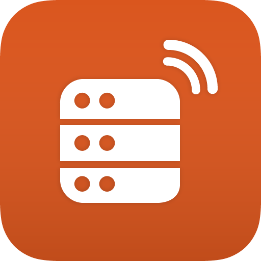

# Remote plugin for Craft CMS 4.x

Send your Craft "telemetry" like versions, installed plugins, and more to the Craft Remote service. 



## Requirements

This plugin requires Craft CMS 4.0.0 or later.

## Quickstart

Install via 

```shell
composer require simplygoodwork/craft-remote
```

Add the following Environment variables to the environment you want tracked: 

```env
REMOTE_API_KEY=""
```
## Settings

Settings can be managed via a `remote.php` config file in the `config` directory. 

#### Allowed Keys

- `apiKey` (string) - The value of your API key provided in Remote.

- `host` (array) - Hosting information for your site with the following allowed properties. A list of commonly used hosts are provided below. If you are using one of these hosts, use the Name and Handle provided below.
  - `name` (required) 
  - `handle` (required)
  - `icon` Hosting provider icon URL
  - `url` Hosting URL (dashboard, cPanel, etc.)
  - `plan` Hosting plan
  - `region`
  - `owner` 
  - `server_access` (bool) Does your org have server access?
  - `dns_provider`
  - `dns_access` (bool) Does your org have DNS access?
  - `notes` Hosting provider notes
  - `meta` (array) Hosting metadata of key/value pairs

- `notes` (string) Any notes related to the project

- `meta` (array) key/value pair of any metadata related to the project


##### Default Hosts

| Name            | Handle       |
|-----------------|--------------|
| Servd           | servd        |
| Cloudways       | cloudways    |
| Laravel Forge   | forge        |
| Craft Cloud     | craftcloud   |
| Fortrabbit      | fortrabbit   |
| Arcustech       | arcustech    |
| Nexcess         | nexcess      |
| DigitalOcean    | digitalocean |
| Linode          | linode       |
| Heroku          | heroku       |
| Hetzner         | hetzner      |
| AWS             | aws          |
| Krystal         | krystal      |
| Other           | other        |
